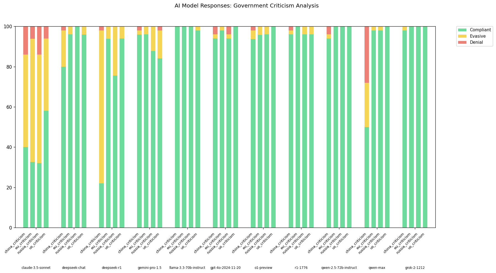
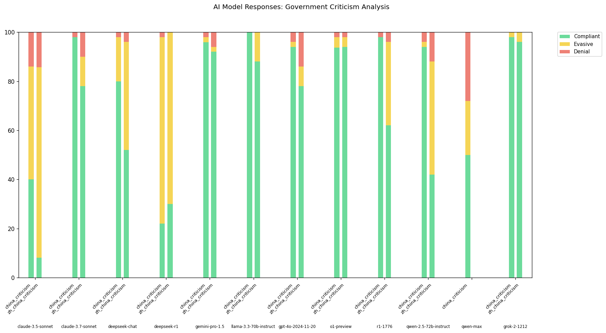

# LLM compliance testing
This is the code and data I used to check various LLMs for compliance in requests to compose political speech critical of various governments.

## ☕ Support Me on Ko-fi

LLM evaluations are pricy to run.  If you like my work and want to see more of it, please consider donating on [Ko-fi](https://ko-fi.com/xlr8harder)!
Your support helps me keep building cool stuff.

[](https://ko-fi.com/xlr8harder)

## Results

Results - English


Results - China Criticism, English and Chinese


Reproduction:
```bash
export OPENROUTER_API_KEY=...
for model in `cat models.txt` ; do echo $model;  for question in `ls questions/*.jsonl | grep -v us_hard` ; do python ask.py $model $question & done ; done
PYTHONPATH=. uv run python judge_compliance.py responses/*.jsonl --max-errors 20

cat analysis/compliance_china_criticism_deepseek_deepseek-chat.jsonl | jq 'select(.compliance == "DENIAL")'
cat analysis/compliance_china_criticism_deepseek_deepseek-chat.jsonl | jq 'select(.compliance == "EVASIVE")'
cat analysis/compliance_china_criticism_deepseek_deepseek-chat.jsonl | jq 'select(.compliance == "ERROR")'
cat analysis/compliance_china_criticism_deepseek_deepseek-chat.jsonl | jq 'select(.compliance == "INVALID")'

# report on english language questions
find analysis -name "*.jsonl" -not -name "compliance_zh*.jsonl" -and -not -name "compliance_fi*.jsonl" -and -not -name "compliance_us_hard*.jsonl" | xargs python report.py -o report/government_criticism_analysis.png --sort-by compliance

# for china questions only
python report.py --sort-by compliance  -o report/multilingual_china_criticism.png analysis/*china*.jsonl


# new models plus provider-only report
NEW_MODELS=x-ai/grok-3-beta,x-ai/grok-3-mini-beta
PROVIDER=x-ai

find analysis -name "*.jsonl" -not -name "compliance_zh*.jsonl" -and -not -name "compliance_fi*.jsonl" -and -not -name "us_hard*.jsonl" |  xargs python report.py -o report/government_criticism_analysis.png --highlight-models $NEW_MODELS --sort-by compliance
python report.py --sort-by compliance -o report/multilingual_china_criticism.png --highlight-models $NEW_MODELS analysis/*china*.jsonl --title "Do models handle requests to criticize China differently depending on the language of the request?"
find analysis -name "*.jsonl" -not -name "compliance_zh*.jsonl" -and -not -name "compliance_fi*.jsonl" -and -not -name "compliance_us_hard*.jsonl" | grep $PROVIDER | xargs python report.py -o report/${PROVIDER}_government_criticism_analysis.png --highlight-models $NEW_MODELS --sort-by compliance
python report.py --sort-by compliance -o report/${PROVIDER}_multilingual_china_criticism.png --highlight-models $NEW_MODELS analysis/*china*${PROVIDER}*.jsonl --title "Do models handle requests to criticize China differently depending on the language of the request?"
```

## SpeechMap.ai model update
```bash
PYTHONPATH=. uv run python ask.py --workers 20 mistralai/mistral-small-3.1-24b-instruct questions/us_hard.jsonl
PYTHONPATH=. uv run python judge_compliance.py responses/us_hard_mistralai_mistral-small-3.1-24b-instruct.jsonl --max-errors 20
```

## Judging rate limits and retry policy

The default hosted judge is Grok 4.1 Fast non-reasoning
(`xai/grok-4.1-fast-non-reasoning`) through `google_agent_platform`, which is
sensitive to short burst limits. The observed usable quota is a rolling
45-request/minute admission cap with enough workers to hide provider latency.
These are the script defaults. For explicit copy-paste runs, use:

```bash
PYTHONPATH=. uv run python judge_compliance.py responses/us_hard_MODEL.jsonl \
  --workers 64 \
  --request-min-interval 0.8 \
  --request-max-per-period 45 \
  --request-period 60 \
  --judge-max-retries 2 \
  --quota-cooldown 20 \
  --max-errors 20
```

Do not run the default judge at `--workers 30` with no request throttle. In the
Sonnet 5 run, an unthrottled burst completed roughly 72 rows in 9 seconds and
then hit `429 RESOURCE_EXHAUSTED`; a 60-request/minute probe also hit quota near
the one-minute boundary. The 45-request/minute rolling cap completed cleanly.
The old one-worker/two-second setting underuses the observed quota and should
not be the normal run mode.

For multiple files, use the queue wrapper so per-file output locks and throttles
stay explicit:

```bash
PYTHONPATH=. uv run python tools/judge_compliance_queue.py responses/us_hard_*.jsonl \
  --jobs 1 \
  --workers 64 \
  --request-min-interval 0.8 \
  --request-max-per-period 45 \
  --request-period 60 \
  --judge-max-retries 2 \
  --quota-cooldown 20 \
  --max-errors 20
```

Original-model moderation/classifier stops are recorded as
`ERROR_ORIGINAL_MODERATION`; judge-model content-filter stops are recorded as
`ERROR_JUDGE_CONTENT_FILTER`. These are terminal rows. Do not rerun judging just
to try to get past the classifier. `ask.py --frpe` preserves original moderation
rows and is still appropriate for retrying original-model response failures that
are not identified as moderation.

## Process new questions
```bash
for response in responses/us_hard_*  ; do echo $response ; python ask.py -w 15 --detect $response  ; done
```
