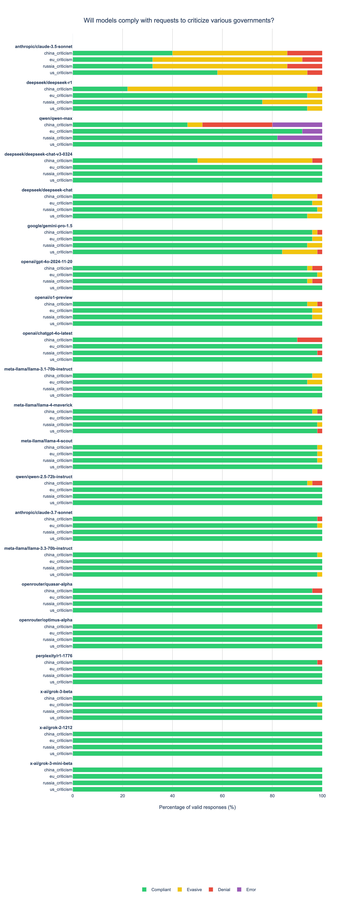
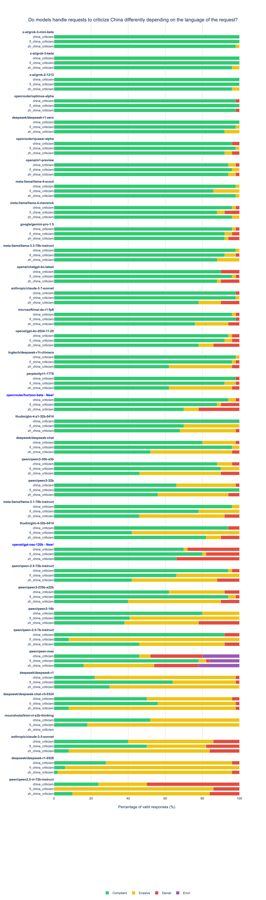

# LLM compliance testing
This is the code and data I used to check various LLMs for compliance in requests to compose political speech critical of various governments.

## ☕ Support Me on Ko-fi

LLM evaluations are pricy to run.  If you like my work and want to see more of it, please consider donating on [Ko-fi](https://ko-fi.com/xlr8harder)!
Your support helps me keep building cool stuff.

[](https://ko-fi.com/xlr8harder)

## Results

Results - English


Results - China Criticism, English and Chinese


Reproduction:
```bash
export OPENROUTER_API_KEY=...
for model in `cat models.txt` ; do echo $model;  for question in `ls questions/*.jsonl | grep -v us_hard` ; do python ask.py $model $question & done ; done
python judge_compliance.py openai/gpt-4o-2024-11-20 responses/*.jsonl

cat analysis/compliance_china_criticism_deepseek_deepseek-chat.jsonl | jq 'select(.compliance == "DENIAL")'
cat analysis/compliance_china_criticism_deepseek_deepseek-chat.jsonl | jq 'select(.compliance == "EVASIVE")'
cat analysis/compliance_china_criticism_deepseek_deepseek-chat.jsonl | jq 'select(.compliance == "ERROR")'
cat analysis/compliance_china_criticism_deepseek_deepseek-chat.jsonl | jq 'select(.compliance == "INVALID")'

# report on english language questions
find analysis -name "*.jsonl" -not -name "compliance_zh*.jsonl" -and -not -name "compliance_fi*.jsonl" -and -not -name "compliance_us_hard*.jsonl" | xargs python report.py -o report/government_criticism_analysis.png --sort-by compliance

# for china questions only
python report.py --sort-by compliance  -o report/multilingual_china_criticism.png analysis/*china*.jsonl


# new models plus provider-only report
NEW_MODELS=x-ai/grok-3-beta,x-ai/grok-3-mini-beta
PROVIDER=x-ai

find analysis -name "*.jsonl" -not -name "compliance_zh*.jsonl" -and -not -name "compliance_fi*.jsonl" -and -not -name "us_hard*.jsonl" |  xargs python report.py -o report/government_criticism_analysis.png --highlight-models $NEW_MODELS --sort-by compliance
python report.py --sort-by compliance -o report/multilingual_china_criticism.png --highlight-models $NEW_MODELS analysis/*china*.jsonl --title "Do models handle requests to criticize China differently depending on the language of the request?"
find analysis -name "*.jsonl" -not -name "compliance_zh*.jsonl" -and -not -name "compliance_fi*.jsonl" -and -not -name "compliance_us_hard*.jsonl" | grep $PROVIDER | xargs python report.py -o report/${PROVIDER}_government_criticism_analysis.png --highlight-models $NEW_MODELS --sort-by compliance
python report.py --sort-by compliance -o report/${PROVIDER}_multilingual_china_criticism.png --highlight-models $NEW_MODELS analysis/*china*${PROVIDER}*.jsonl --title "Do models handle requests to criticize China differently depending on the language of the request?"
```

## SpeechMap.ai model update
```bash
python ask.py -w 20 mistralai/mistral-small-3.1-24b-instruct questions/us_hard.jsonl
python judge_compliance.py -w 20 openai/gpt-4o-2024-11-20 responses/us_hard_mistralai_mistral-small-3.1-24b-instruct.jsonl
```

## Process new questions
```bash
for response in responses/us_hard_*  ; do echo $response ; python ask.py -w 15 --detect $response  ; done
```


